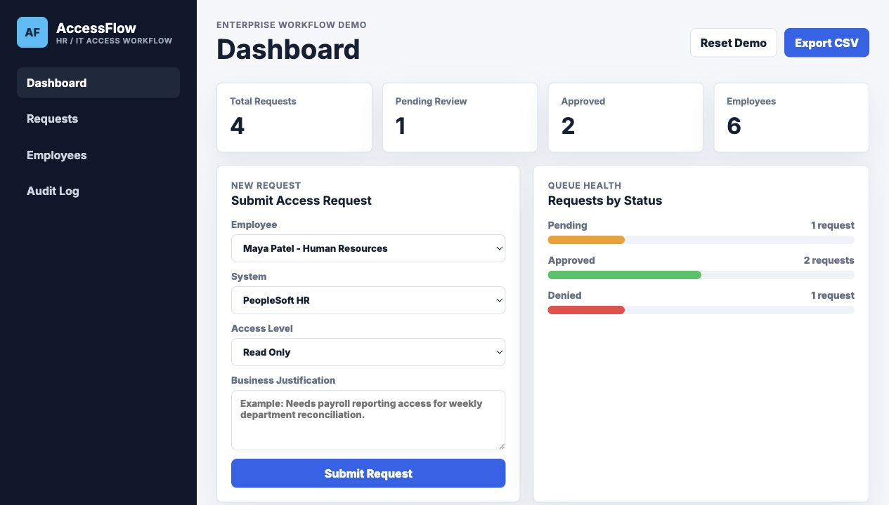

# AccessFlow

AccessFlow is a mock enterprise access request system inspired by the kind of internal tools used across HR, IT, payroll, and operations teams.

I built this project because I wanted to show more than a polished front end. A lot of real software work happens inside business systems where the important parts are clear workflows, accurate records, approval steps, searchable data, and audit history. AccessFlow models that kind of environment in a small, approachable app.

Live demo: https://briannab1997.github.io/BB-AccessFlow/

## Screenshot



## What It Does

- Employees can submit access requests with a system, access level, and business justification.
- Managers and admins can review pending requests and approve or deny them.
- The dashboard shows request totals, pending work, approvals, and employee counts.
- Requests can be searched, filtered by status, and exported to CSV.
- Employee records include department, title, manager, and location details.
- Every important action is written to an audit log.
- Demo data is stored locally so the app can be reset and walked through repeatedly.

## Why This Project

AccessFlow is meant to connect my software engineering background with my experience in healthcare and operations environments, where accuracy, documentation, and process matter. It is not meant to be a real access management product. It is a portfolio project that shows I can think through the shape of business software:

- Who is using the system?
- What information do they need to see?
- What state can a request be in?
- What actions should be tracked?
- How can the interface stay clear for repeated daily use?

Those questions matter in enterprise development, QA, and systems work, which is exactly the kind of space I am interested in growing into.

## Highlights

- Role-based views for Employee, Manager, and Admin
- Approval queue with approve/deny actions
- Request status tracking
- Audit log for traceability
- Search and filter tools for request records
- CSV export for reporting
- Responsive layout for desktop and mobile
- Small test suite for seeded data and helper logic

## Skills Demonstrated

- Enterprise workflow design
- Role-based user interface patterns
- Access request and approval logic
- Audit logging and traceability
- Search, filtering, and CSV reporting
- Local persistence with browser storage
- QA-minded validation through tests

## Tech Stack

- HTML5
- CSS3
- Vanilla JavaScript
- Browser localStorage

## Run Locally

```bash
npm start
```

Then open:

```text
http://localhost:8000
```

## Test

```bash
npm test
```

The current test file checks the seeded data, request ID generation, employee lookup, status handling, and basic request integrity.

## Project Structure

```text
.
├── css/
│   └── style.css
├── js/
│   └── app.js
├── tests/
│   └── app.test.js
├── index.html
├── package.json
└── README.md
```

## Portfolio Summary

AccessFlow is a mock enterprise workflow app that demonstrates role-based request handling, approval state management, audit logging, searchable records, and CSV reporting for HR/IT access requests.
